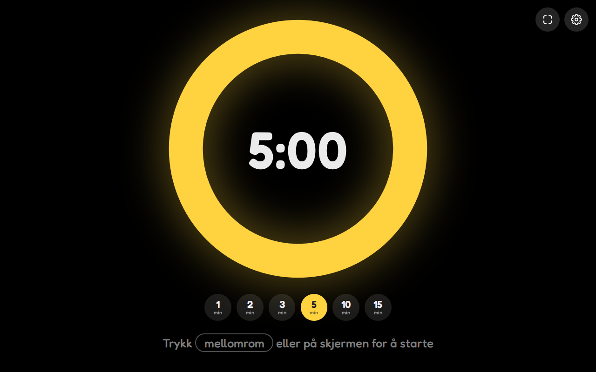
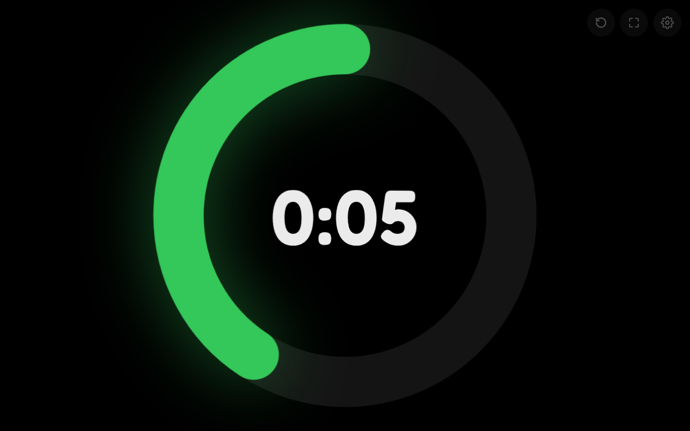
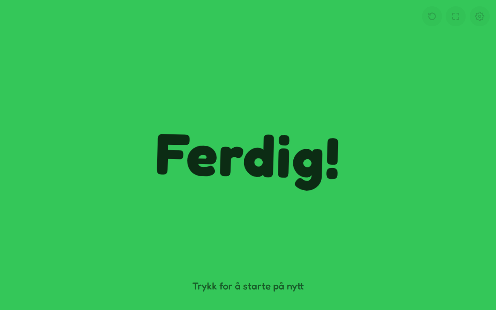

# ⏳ Nedtelling · Countdown

A big, colorful countdown timer for kids — for tidying up, brushing teeth,
screen time or "five more minutes". A colored ring drains like a clock hand
eating it up, so even kids who can't read the numbers can see how much time is
left. When time is up, the screen bursts into color and plays a little chime.

**▶ [countdown.apphub.casa](https://countdown.apphub.casa)**

<p align="center">
  
  &nbsp;
  
  &nbsp;
  
</p>

## How to use

1. Open the page on a TV, tablet or laptop — ideally fullscreen (⛶ button).
2. Pick a time: tap 1, 2, 3, 5, 10 or 15 minutes, or set any time in settings (⚙).
3. Press **space**, **Enter** or tap anywhere to start. Tap again to pause.
4. **↺**, **R** or **Esc** starts over.

## Features

- 🎨 **Pick a color** for the ring and the "done" screen.
- 🔔 **Chime when time is up** (toggle).
- 🔢 **Hide the numbers** if you only want the ring.
- 🇳🇴🇬🇧 **Norwegian and English** — follows the browser, or pick one.
- 📺 **Made for a big screen** — fullscreen button, keeps the screen awake, and
  the buttons fade away while it runs.
- 📲 **Installable** — add it to the home screen; it works offline too.
- 🔒 **No accounts, no tracking** — settings live in the browser's `localStorage`.

## Development

No build step and no dependencies — the app is
[`public/index.html`](public/index.html) plus its PWA files. Serve `public/`
with any static server (the service worker needs http, not `file://`):

```sh
cd public && python3 -m http.server
```

or `npx wrangler dev`.

## Deploy

Served as a Cloudflare Worker with static assets, with `countdown.apphub.casa`
as a custom domain (see [`wrangler.jsonc`](wrangler.jsonc)). Pushing to `main`
deploys via Workers Builds; by hand:

```sh
npx wrangler deploy
```

Fredoka is self-hosted under the [SIL Open Font License](public/fonts/OFL.txt).
